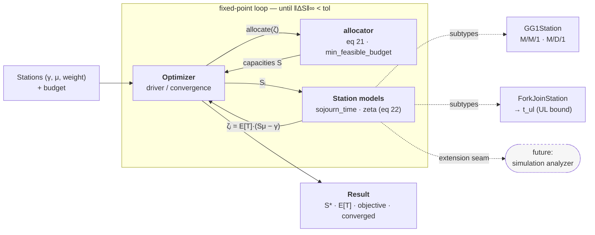

# Queueing Network Capacity Allocation Optimizer

A Python optimizer that allocates resource capacities `S` across a **network of queues** to
minimize the sum of weighted expected sojourn times subject to a budget and stability
constraints. It implements the Section-5 fixed-point iteration of the analysis paper
(`docs/analysis.pdf`, "Optimization and Performance Analysis of Resource Allocation in
Quantum-Centric Supercomputing Environments").

## Model

The network is a collection of **stations**. Two types:

- **Single-server queue** — a G/G/1 queue analyzed with the Kingman / Allen–Cunneen
  mean-value approximation, parameterized by the coefficients of variation of interarrival
  (`cov_a`) and service (`cov_s`) times. M/M/1 (`cov_a=1, cov_s=1`) and M/D/1
  (`cov_a=1, cov_s=0`) are presets; the approximation is exact for any M/G/1.
- **Fork-join queue** — two parallel servers (ratio `r ≥ 1`), analyzed with the UL
  (upper–lower bound interpolation) approximation.

Arrival rates `γ` are fixed per-station constants; the optimizer iterates on the capacity
vector `S` until the optimal `S*` is reached.

## Architecture



Each iteration re-allocates capacities from the current `ζ` (eq 21), then recomputes `ζ`
from the resulting capacities (eq 22); the loop repeats until the capacity vector stops
moving. Stations are the pluggable analyzer layer — each owns its own queueing math behind
the `Station` interface, which is also the seam for a future network-simulation analyzer.

## Scope & limitations

Each station is analyzed **independently** from its own arrival rate and coefficients of
variation. The optimizer does **not** model how one station's *departure* process shapes the
*arrival* variability of downstream stations — i.e. variability propagation through the
network is not captured. Doing so faithfully requires **simulation** of the whole network
rather than closed-form per-station analysis. The current per-station analysis is therefore
an **approximation**, and full network coupling is a planned area for **future work**
(the same extension seam as a future simulation-based analyzer).

## Status

Implemented. Core library (`qopt`) with single-server (G/G/1) and fork-join stations,
the eq-21 allocator, and the fixed-point `Optimizer`. Test suite passes.

## Usage

Install the package (editable) so `qopt` is importable:

```
pip install -e .
```

```python
from qopt import GG1Station, ForkJoinStation, Optimizer, min_feasible_budget

stations = [
    GG1Station.mm1(gamma=0.6, mu=1.0, c=2.0, name="ingest"),
    GG1Station.md1(gamma=0.4, mu=1.0, c=1.0, name="transform"),
    ForkJoinStation(gamma=0.5, mu=1.0, r=2.0, c1=1.0, c2=1.0, name="fork-join"),
]
result = Optimizer(stations, budget=6 * min_feasible_budget(stations)).run()
print(result.capacities, result.objective, result.converged)
```

See `examples/mixed_network.py` for a runnable version. Running it prints the optimal
allocation (illustrative output; regenerate with `python -m examples.mixed_network`):

```
budget = 15.6000   converged = True in 6 iterations
station                        S*       E[T]       zeta
ingest (M/M/1)             2.9601     0.4237     1.0000
transform (M/D/1)          3.6448     0.2913     0.9451
fork-join                  3.0175     0.4520     1.1378
objective (sum w*E[T]) = 1.166933
```

Note the M/M/1 station's `zeta = 1.0000` exactly, while the M/D/1 and fork-join stations
have load-dependent `zeta` — which is what makes the fixed-point iteration necessary.

If the fixed point is not reached within `max_iter`, `run()` still returns a `Result` (the
last iterate) but sets `converged=False`, records the final `residual` (`‖Sₖ₊₁−Sₖ‖∞`), and
emits a `RuntimeWarning` — inspect `result.converged` before trusting the allocation.

See also:

- `docs/superpowers/specs/2026-07-10-optimizer-design.md` — authoritative design spec.
- `docs/optimizer-brainstorm-summary.md` — problem statement and design rationale.

## License

Licensed under the Apache License, Version 2.0. See [LICENSE](LICENSE).
