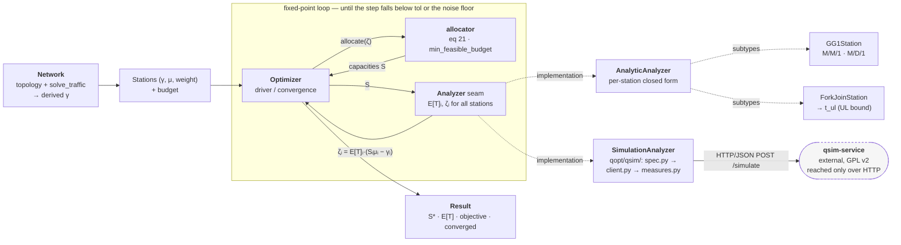

# Queueing Network Capacity Allocation Optimizer

A Python optimizer that allocates resource capacities `S` across a **network of queues** to
minimize the sum of weighted expected sojourn times subject to a budget and stability
constraints. It implements the Section-5 fixed-point iteration of the analysis paper
(`docs/analysis.pdf`, "Optimization and Performance Analysis of Resource Allocation in
Quantum-Centric Supercomputing Environments"). Every `eq N` in this repository refers to that
committed snapshot; the working draft has since renumbered, so see
[`docs/paper-map.md`](docs/paper-map.md) for the crosswalk before reading a citation against a
newer PDF.

## Model

The network is a collection of **stations**. Two types:

- **Single-server queue** — a G/G/1 queue analyzed with the Kingman / Allen–Cunneen
  mean-value approximation, parameterized by the coefficients of variation of interarrival
  (`cov_a`) and service (`cov_s`) times. M/M/1 (`cov_a=1, cov_s=1`) and M/D/1
  (`cov_a=1, cov_s=0`) are presets; the approximation is exact for any M/G/1.
- **Fork-join queue** — two parallel servers (ratio `r ≥ 1`), analyzed with the UL
  (upper–lower bound interpolation) approximation.

Arrival rates `γ` are fixed per-station constants; the optimizer iterates on the capacity
vector `S` until the optimal `S*` is reached.

## Architecture



Each iteration re-allocates capacities from the current `ζ` (eq 21), then recomputes `ζ`
from the resulting capacities (eq 22); the loop repeats until the capacity vector stops
moving. Stations are the pluggable analyzer layer — each owns its own queueing math behind
the `Station` interface. Whole-network simulation plugs in one level *up*, at a network-level
`Analyzer` seam, because a simulation answers for every station in a single run rather than
station by station: `AnalyticAnalyzer` calls each station's own closed form, while
`SimulationAnalyzer` serializes the whole `Network` (topology and derived `γ`) into a
qsim-service request, issues one `POST /simulate` per optimizer iteration, and translates
the response's measures back into the same `(E[T], ζ)` shape — so the allocator and the loop
never know which analyzer is running.

### ζ calibration: level (default) or slope

`ζ` is the one free parameter that carries a station's queueing behaviour into eq 21.
Eq 22 fixes it by matching the *level* of the sojourn-time curve, `ζ = E[T]·(Sμ − γ)`, and
that is what `qopt` does by default.

Eq 21, though, water-fills on *marginal* returns: it reads the surrogate `T̂ = ζ/x` only
through its derivative and never evaluates it. Matching the slope instead,

    ζ = φ·E[T]·x,    φ = |dE[T]/dS|·x/(μ·E[T])

makes the loop's fixed point the coupled optimum exactly rather than an approximation of
it. Select it per station:

```python
from qopt import GG1Station, ZETA_SLOPE

st = GG1Station(0.6, 1.5, c=2.0, cov_a=2.0, cov_s=2.0, zeta_mode=ZETA_SLOPE)
```

`φ ≡ 1` for M/M/1 — algebraically exactly, and to within one ulp in floating point, so an
all-M/M/1 network under slope mode reproduces level mode to machine precision rather than
bitwise. (The *default* path's guarantee is the bitwise one, and narrower: the level arm
computes `E[T]·(Sμ − γ)` in exactly today's operations and order, so a run with no
`zeta_mode` set returns the same floats as before this existed.) The gain tracks
`|φ − 1|`: 0.0002–0.039% where only fork-join stations deviate, up to 0.515% once
single-server stations are not M/M/1, and 1.59% on the stress network of
`docs/slope-calibrated-zeta/findings.md` §6. `Result.zeta` is the ζ implied by the
*reported* `E[T]` at the converged capacities — on a stochastic run that means the
fresh-seed FINAL evaluation, a different sample path from the CRN iterate that actually set
those capacities, and the last loop iterate only when `final_evaluation=False` suppresses
that run. `Result.zeta_phi` and `Result.zeta_mode` sit alongside it, so eq 22's value
for the reported `E[T]` is recoverable as
`0.0 if zeta_phi[i] == 0.0 else zeta[i]/zeta_phi[i]`. The guard covers exactly one case, a
station that admits full utilization sitting on `S*mu == gamma`, where eq 22's value is
`E[T]*x == 0` and `phi` is zero too; see `Result.zeta_phi`.

On convergence: the contraction proof behind `qopt`'s convergence argument is for the
level map. Slope mode changes that map, so its convergence is so far empirical — across the
13 budgets of `docs/slope-calibrated-zeta/findings.md` §7, from `1.0001×` to `1e4×` the
floor, both modes converge in at most 18 iterations and never more than three apart, with
0 failures and 0 off-optimum rows. Redoing the proof for the new map is tracked as step 4
of that file's §8.

This is a deliberate divergence from eq 22, not an amendment to it — see
`docs/slope-calibrated-zeta/` for the derivation and the measurements.

**One caveat worth reading before switching a simulated run.** φ is computed from the
station's *analytic* model even when `E[T]` is measured, which is what keeps the simulator
in control of the allocation's level. That promotes `cov_a` from nearly decorative to a
live input: it is never sent to the simulator and never measured back, so under slope
calibration it must describe the arrival process the station *actually* sees, internal
traffic included. **When it is unknown, the assumption that forfeits the gain rather than
overshooting past it is the one that reproduces level calibration** — and that is *not*
`cov_a = 1` in general. φ depends on the two coefficients of variation only through
`k = (cov_a² + cov_s²)/2`, is strictly increasing in `k`, and equals 1 exactly at `k = 1`.
So the level-equivalent choice is `cov_a = √(2 − cov_s²)` — `1` for an M/M/1-shaped
service, but `√2 ≈ 1.414` for a deterministic-service station (`cov_s = 0`, the service
shape of the shipped `md1` preset), where assuming `cov_a = 1` gives `k = 0.5` and φ < 1 at
every load (≈ 0.833 at ρ = 0.5) — the far side of 1 from any truth with `k > 1`, and
measurably worse than eq 22 rather than gracefully degraded. When `cov_s > √2` no arrival
process reaches `k = 1` at all and φ > 1 whatever you assume; `cov_a = 0` is then the
closest approach. Overstating `k` in either variable is the direction that overshoots.
`Optimizer` cross-checks measured against analytic `E[T]` for slope stations and reports
disagreements in `Result.zeta_shape_flags` (tolerance: `zeta_shape_tol`, default 25%). That
check runs inside the loop, against the iterate that produced each allocation — not after
the final fresh-seeded evaluation — so on a stochastic run `zeta_shape_flags` warrants the
trajectory that set the capacities, not the `E[T]` values `Result` goes on to report. If
you know the true arrival variability but cannot express it as a `cov_a`, override `phi(S)`
on a subclass.

## Scope & limitations

By default, each station is analyzed **independently** (`AnalyticAnalyzer`) from its own
arrival rate and coefficients of variation — exact for M/M/1 and M/G/1, an
**approximation** for a general network.

- **Network coupling is supported via simulation.** Per-station closed forms cannot
  capture how one station's departure process shapes the arrival variability of the
  stations downstream of it. `SimulationAnalyzer` obtains `E[T]` from a discrete-event
  simulation of the whole network (one `POST /simulate` per optimizer iteration) via
  [`qsim-service`](https://github.com/atantawi/qsim-service), so that coupling is
  captured directly. `qopt` speaks HTTP/JSON only and declares zero runtime
  dependencies; the service is GPL v2 and stays behind that boundary.
- **Single open chain only.** One customer chain enters from a source and departs to a
  sink, so every `γᵢ` is exogenously determined and fixed across iterations. Closed
  chains would make `λ` depend on `S` through throughput, moving eq 21's budget floor
  underneath the optimizer; multi-class networks need a per-class notion eq 21 does not
  have. Both are honest open limitations, not oversights.
- **Fork-join measures other than `response-time` are diagnostics only.** JMT defines
  just two fork-join region measures, so `utilization`, `queue-length`, and friends
  report join-station numbers at a fork-join node
  ([qsim-service#8](https://github.com/atantawi/qsim-service/issues/8)). Nothing
  outside `response-time` enters eq 22, so this constrains reporting, not results.

See
[`docs/superpowers/specs/2026-07-29-simulation-support-design.md`](docs/superpowers/specs/2026-07-29-simulation-support-design.md)
for the full design.

## Status

Implemented. Core library (`qopt`) with single-server (G/G/1) and fork-join stations, the
eq-21 allocator, and the fixed-point `Optimizer`; plus `Network` (topology with `γ` derived
from the traffic equations) and the simulation-backed evaluation path (`Analyzer` seam,
`SimulationAnalyzer`, `qopt/qsim/` client). Test suite passes; the simulation path's
end-to-end oracles run against a live `qsim-service` and are skipped unless
`QOPT_QSIM_URL` is set. Zero runtime dependencies.

## Usage

Install the package (editable) so `qopt` is importable:

```
pip install -e .
```

```python
from qopt import GG1Station, ForkJoinStation, Optimizer, min_feasible_budget

stations = [
    GG1Station.mm1(gamma=0.6, mu=1.0, c=2.0, name="ingest"),
    GG1Station.md1(gamma=0.4, mu=1.0, c=1.0, name="transform"),
    ForkJoinStation(gamma=0.5, mu=1.0, r=2.0, c1=1.0, c2=1.0, name="fork-join"),
]
result = Optimizer(stations, budget=6 * min_feasible_budget(stations)).run()
print(result.capacities, result.objective, result.converged)
```

`ForkJoinStation` also takes an optional `r_star`, which picks the ray its two effective
rates lie on (`m₂ = r_star·m₁`) and prices it `c₁ + c₂·r_star/r`, where `r` throughout this
section is the ratio passed at CONSTRUCTION — the attribute `ForkJoinStation.r` is the
*effective* ratio, which `r_star < 1` swaps, and `alloc_cost` reads `r_base` for exactly
that reason. Pass a float for a fixed ray, or one of three named policies:

| `r_star` | ray | cost | |
|---|---|---|---|
| `R_STAR_INVARIANT_R` | `r_star = r` | `c₁ + c₂` | the default: both servers get capacity `S` |
| `R_STAR_EQUAL_RATE` | `r_star = 1` | `c₁ + c₂/r` | equal effective rates — the paper's rule |
| `R_STAR_TUNED` | solved | `c₁ + c₂·r_star/r` | the local optimality condition at the station's own spend; starts at `r_star = 1`, the ray that minimizes the station's stability floor |

Neither incumbent dominates the other: the paper's rule wins `classical_dominant` by
24.55% and loses `quantum_dominant` by 5.47%. `R_STAR_TUNED` re-solves `r_star` on every
optimizer iteration — a fixed point nested inside eq 21/22 — and reaches what a grid sweep
of `r_star` finds, in all three workloads. It does that by *mutating* the station, so
`r_star` after a run is that run's chosen ray; the `Optimizer` restores the starting ray
once every run has cleared its guards, which keeps a run a pure function of the stations as
constructed and the budget, however many times the same objects are reused, and leaves a
previous answer intact when a run is rejected. `min_feasible_budget` is likewise answered
for the *policy* rather than for the ray a station currently sits on, so budgets scaled off
it mean the same thing before and after a run. See
[`docs/forkjoin-s2-policy/findings.md`](docs/forkjoin-s2-policy/findings.md) and
[`implementation.md`](docs/forkjoin-s2-policy/implementation.md).

Those gains are **measured, not only derived.** A simulated cross-check against
`qsim-service` — 3 workloads x 3 policies x 5 base seeds, paired under common random
numbers — confirms every one of them, with each analytic gain landing inside its own
measured 95% interval: tuned beats the default by 2.54% / 2.15% / 24.47% against 2.37% /
2.15% / 24.55% predicted. The bias of the fork-join approximation at the tuned operating
point turns out indistinguishable from its bias at the default (-0.132% against -0.126%
mean over 210 station rows each), which was the open doubt. `docs/forkjoin-s2-policy/simcheck.py`
and `simcheck-output.txt` hold the run.

That form — a plain list of stations with hand-supplied `gamma` — remains fully supported.
`examples/mixed_network.py` is the same three stations wired into a `Network` instead, so
`gamma` is *derived* from the topology rather than supplied; it reaches the identical
numbers. Running it (`python -m examples.mixed_network`) prints:

```
budget = 15.6000   converged = True in 6 iterations
station                   gamma         S*       E[T]       zeta
mm1                      0.6000     2.9601     0.4237     1.0000
md1                      0.4000     3.6448     0.2913     0.9451
fj                       0.5000     3.0175     0.4520     1.1378
objective (sum w*E[T]) = 1.166933
```

Note the M/M/1 station's `zeta = 1.0000` exactly, while the M/D/1 and fork-join stations
have load-dependent `zeta` — which is what makes the fixed-point iteration necessary.

If the fixed point is not reached within `max_iter`, `run()` still returns a `Result` (the
last iterate) but sets `converged=False`, records the final `residual` (`‖Sₖ₊₁−Sₖ‖∞`), and
emits a `RuntimeWarning` — inspect `result.converged` before trusting the allocation.

### Simulated evaluation

```python
from qopt import (GG1Station, Network, Optimizer, QsimClient, Route,
                  SimulationAnalyzer, min_feasible_budget)

network = Network(
    [GG1Station.md1(mu=1.0, c=1.0, name="shape"),
     GG1Station.mm1(mu=1.0, c=1.0, name="serve")],
    [Route(Network.SOURCE, "shape"), Route("shape", "serve"),
     Route("serve", Network.SINK)],
    arrival_rate=1.0,
)                                        # gamma is derived from the topology
client = QsimClient("http://localhost:8080", preflight=True)
result = Optimizer(
    network,
    budget=3 * min_feasible_budget(network.stations),
    analyzer=SimulationAnalyzer(network, client),
).run()
print(result.capacities, result.sojourn_ci, result.sim_calls, result.stop_reason)
```

A simulated run has one more way to stop than an analytic one. A station with
`cov_a == cov_s == 0` may be priced at `S*mu == gamma` analytically — `E[T] = 1/(S*mu)` is
finite there — but the simulator takes its arrival process from the network's `arrival_scv`
and the routing rather than from the station's `cov_a`, so at the default `arrival_scv=1.0`
that station is a saturated M/D/1 and `SimulationAnalyzer` refuses the capacity. When the iteration
walks onto it, `run()` stops before evaluating it, reports `stop_reason="analyzer-domain"`
with `converged=False`, warns, and returns the last capacities the analyzer actually
evaluated. The same check declines an analytic warm start that lands there, falling back to
the cold eq-21 allocation.

Runnable versions: `examples/simulated_tandem.py`,
`examples/simulated_mixed_network.py`, and `examples/qcsc_network.py` — the paper's
14-station QCSC network under three workloads (balanced, quantum-dominant,
classical-dominant). All fall back to analytic-only output when `QOPT_QSIM_URL` is unset.

A simulated measure can come back as a mean with no confidence interval. That never fails the
run — the mean is all the mathematics needs — so `result.sojourn_ci` carries `None` in that
station's slot, `result.system_response_time` keeps its `(mean, (lower, upper))` shape with
`None` bounds, and each case adds a `RuntimeWarning` plus a `result.degraded` entry. Code that
formats those bounds has to expect the `None`s; `_print_table` in
`examples/simulated_mixed_network.py` shows the guard.

See also:

- `docs/superpowers/specs/2026-07-10-optimizer-design.md` — authoritative design spec.
- `docs/superpowers/specs/2026-07-29-simulation-support-design.md` — simulation support
  (topology, `Analyzer` seam, `qsim-service` client). Implemented; see `SimulationAnalyzer`.
- `docs/superpowers/specs/2026-07-31-qcsc-example-network-design.md` — the QCSC example
  network (topology, workloads, budget). Implemented; see `examples/qcsc_network.py`.
- `docs/optimizer-brainstorm-summary.md` — problem statement and design rationale, as a
  2026-07-10 record. Two of its scope decisions were later reversed; its header note says
  which, and points back here for current behaviour.
- `docs/paper-map.md` — which paper `eq N` refers to, and the crosswalk to the newer draft.
- `docs/forkjoin-coupled-vs-separate/findings.md` — why each fork-join station's `r*` is solved
  on its own rather than as one coupled problem. Analysis only; no change proposed.
- `docs/slope-calibrated-zeta/findings.md` — the derivation behind `zeta_mode=ZETA_SLOPE`
  and the measurements backing it: exact recovery of the coupled optimum, gains up to
  0.515%, and why the default stays level-calibrated.

## License

Licensed under the Apache License, Version 2.0. See [LICENSE](LICENSE).
